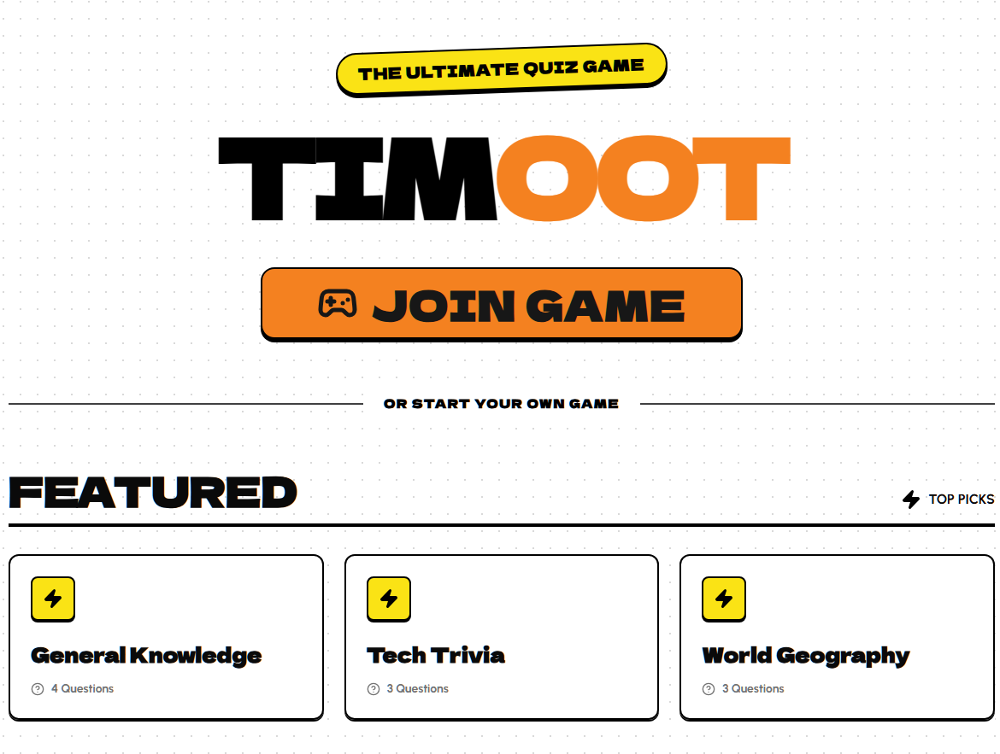

# Timoot

[](https://deploy.workers.cloudflare.com/?url=https://github.com/TimoWilhelm/timoot)



Real-time quiz games that bring people together. Built on Cloudflare's edge.

## What is Timoot?

Timoot turns any gathering into an interactive quiz experience. Whether you're running a team all-hands, teaching a class, or just hanging out with friends — Timoot makes it easy to create and host live trivia.

**How it works:**

- **Host** throws the quiz up on a shared screen
- **Players** join from their phones via PIN or QR code
- **Everyone** competes in real-time with instant scoring

Every game runs on its own Durable Object, keeping state synced across all players via WebSockets. Zero lag, global scale.

## Features

- **AI-Powered Quiz Generation** — Describe your topic, get a quiz with a matching shared background instantly
- **Real-time Multiplayer** — WebSocket-powered gameplay with sub-second updates
- **Two-Screen Experience** — Big screen for the host, phones for players
- **Instant Join** — PIN code or QR scan, no app download needed
- **Speed Scoring** — Faster correct answers = more points
- **Quiz Editor** — Build and customize your own quizzes
- **Edge-Native** — Runs entirely on Cloudflare Workers and Durable Objects

## Tech Stack

| Layer             | Tools                                  |
| ----------------- | -------------------------------------- |
| **Frontend**      | React, TypeScript, Tailwind CSS        |
| **Data Fetching** | TanStack React Query, Hono RPC         |
| **Client State**  | Zustand                                |
| **Animations**    | Framer Motion                          |
| **Backend**       | Cloudflare Workers, Hono               |
| **Realtime**      | Cloudflare Durable Objects, WebSockets |
| **AI**            | Workers AI, Vercel AI SDK              |
| **Storage**       | Durable Objects SQLite, KV             |
| **Build**         | Vite, Bun, @cloudflare/vite-plugin     |
| **Testing**       | Vitest, Playwright, Storybook          |
| **Quality**       | ESLint, Prettier, Knip                 |

## Getting Started

### Prerequisites

- [Bun](https://bun.sh/) — fast JS runtime and package manager
- Node.js 24 (see `.nvmrc`); the pinned Cloudflare `cf` CLI requires Node.js 22 or newer
- A [Cloudflare account](https://dash.cloudflare.com/sign-up) (free tier works)

### Setup

```bash
# Clone the repo
git clone https://github.com/TimoWilhelm/timoot.git
cd timoot

# Install dependencies
bun install

# Log into Cloudflare
bunx cf auth login
```

### Environment

Copy `.env.example` to `.env.local` and fill in the required values:

```bash
cp .env.example .env.local
```

For production, configure runtime variables in your [Cloudflare Dashboard](https://dash.cloudflare.com/) under `Workers & Pages → Settings → Variables` and any build-time variables in your CI/CD system (e.g. GitHub Actions).

### Local build validation

For credential-free validation, use an isolated checkout/export without ignored `.env*` or `.dev.vars*` files, a sanitized environment, and a separate `HOME`. Bun can load environment files before the Vite configuration runs.

```bash
CF_LOCAL_VALIDATION=true CI=true bun run build
bunx cf deploy --prebuilt --mode production --dry-run
```

`CF_LOCAL_VALIDATION=true` disables Vite environment-file loading, the Sentry build plugin, and remote bindings for the build. Normal builds retain the existing environment and Sentry behavior. The deployment dry run validates `.cloudflare/output` without credentials, uploads, or API requests; it does not verify live resources.

`cloudflare.config.ts` is the active Worker configuration. `bun run cf-typegen` generates `.cloudflare/types/index.d.ts`; builds and typechecks generate it before using it. The original `wrangler.jsonc` and `worker-configuration.d.ts` remain unchanged for reference. The two current SQLite Durable Object classes are declared in `worker.exports`; completed Wrangler migration history is not replayed. Before any real deployment, verify the live namespaces against these declarations.

## Deploy

Ship it to Cloudflare's edge in one command:

```bash
bun run deploy
```

## License

MIT
